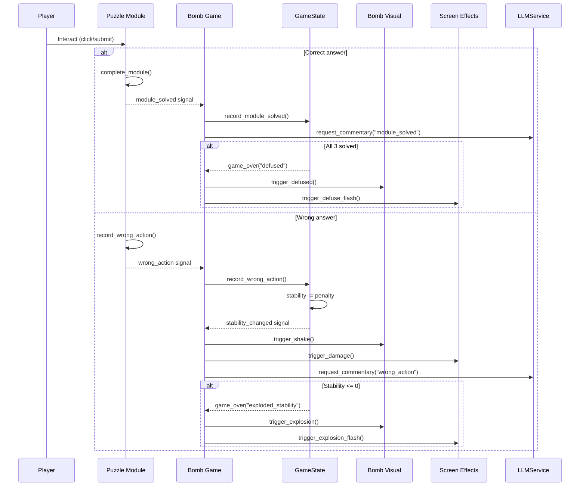
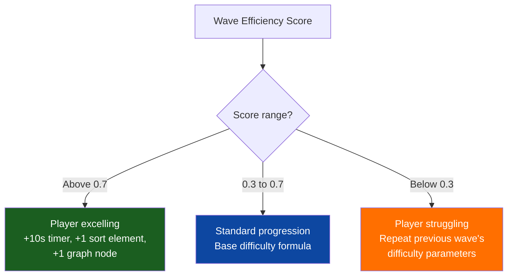

# Bomb Defusal: Algorithm Mode

A **serious game** for Affective Computing research where players defuse algorithm-locked bombs across 10 global cities under time pressure. Built in **Godot 4** with an optional **FastAPI + LLM** backend for dynamic AI commentary.

> Developed as part of a PhD project in Affective Computing at the **University of Ottawa**. The game serves as an experimental stimulus for studying player affect, engagement, and learning outcomes in educational gaming contexts. Every design decision balances gameplay tension with pedagogical value --- the post-game algorithm analysis is a core feature, not an afterthought.

## Play Now

**[Play in Browser on itch.io](https://pouria1206.itch.io/bomb-defusal-serious-game)**

No install required. Works on any modern browser (Chrome, Firefox, Edge, Safari). The game runs entirely client-side with built-in fallback text --- no server needed.

---

## Table of Contents

- [Game Overview](#game-overview)
- [Architecture](#architecture)
- [Puzzle Modules](#puzzle-modules)
- [Campaign Structure](#campaign-structure)
- [Adaptive Difficulty](#adaptive-difficulty)
- [Module Variants](#module-variants)
- [AI Commentary System](#ai-commentary-system)
- [Visual Systems](#visual-systems)
- [Implementation Details](#implementation-details)
- [Getting Started](#getting-started)
- [Deployment](#deployment)
- [Project Structure](#project-structure)
- [Tech Stack](#tech-stack)

---

## Game Overview

Each wave drops the player into a tense scenario: three algorithm-locked puzzle modules sit in front of a ticking bomb. The player must solve all three before time runs out or stability hits zero. Each module teaches a different CS algorithm --- binary search, sorting, graph traversal, boolean logic, and more. Across 10 waves and 10 real-world cities, the difficulty escalates and the modules combine in new ways.


*Complete game flow: scene transitions, win/loss branching, replay paths, and the 4 autoload singletons that persist across scenes.*

**Core mechanics**:
- **Timer**: Counts down from 150s (wave 1) to 60s (wave 10). Visual and audio cues intensify as time drops.
- **Stability**: Starts at 100. Every wrong action costs 10-24 points (scales with wave). Zero stability = explosion.
- **3 modules per wave**: Presented simultaneously. The player chooses which to tackle first --- a strategic decision in itself.
- **Campaign**: 10 waves across Washington D.C., London, Paris, Tokyo, Cairo, Moscow, Mumbai, Sydney, Rio de Janeiro, and Pyongyang. Completing all 10 triggers a victory celebration with a full campaign summary.

---

## Architecture

The game is built on a **signal-driven architecture** where puzzle modules, game state, and visual systems communicate through Godot signals rather than direct references. This keeps modules self-contained and testable independently.

**4 autoload singletons** persist across all scene transitions:

| Singleton | Responsibility |
|-----------|---------------|
| **GameState** | Runtime state (timer, stability, module tracking), emits `stability_changed`, `timer_updated`, `game_over` signals. Also handles F11 fullscreen toggle. |
| **DifficultyManager** | Tracks wave progression and player performance. Computes adaptive difficulty parameters each wave. Implements mercy mode and bonus system. |
| **WaveData** | Static data: 10 city definitions with name, region, GPS coordinates (for map rendering), accent color, threat level, and assigned module triplets. |
| **LLMService** | Async HTTP bridge to the FastAPI backend. Returns fallback text immediately, then hot-swaps with LLM-generated text if the backend responds within 5 seconds. |

### Signal Flow

This sequence diagram shows what happens on every player interaction --- the core loop that drives the entire game:



Additional time-based triggers fire once per game: AI commentary at half-time, a warning when under 30 seconds remain, and a stability warning when below 30%.

---

## Puzzle Modules

All 10 modules inherit from `BaseModule`, which provides shared signals (`module_solved`, `wrong_action`), UI scaffolding (header, hint label, learn label), and methods (`complete_module()`, `record_wrong_action()`, `apply_hint()`). Each module builds its own UI programmatically in `_build_ui()` and generates a fresh puzzle on each `reset_module()` call.

| # | Module | Algorithm Taught | What the Player Does | Variant |
|---|--------|-----------------|---------------------|---------|
| 1 | **Frequency Lock** | Binary Search | Guess a hidden number; get "Too High/Low" feedback narrowing the range | Hot/Cold mode: distance-only feedback, no direction |
| 2 | **Signal Sorting** | Sorting / Inversions | Swap pairs to sort an array; non-improving swaps penalized | Descending sort (30% chance) |
| 3 | **Wire Routing** | Dijkstra's Shortest Path | Click nodes on a weighted graph to build the cheapest route from S to T | --- |
| 4 | **Pattern Sequence** | Pattern Recognition | Find the missing number in a mathematical sequence (10 pattern types) | See table below |
| 5 | **Code Breaker** | Constraint Satisfaction | Mastermind-style deduction with Wordle-colored feedback and a digit tracker | --- |
| 6 | **Memory Matrix** | Spatial Memory / Caching | Memorize a grid pattern shown for 3 seconds, then reproduce it | --- |
| 7 | **Bit Cipher** | Binary Representation | Toggle bits ON/OFF to build a target decimal number | Decode mode: read pre-set binary, type the decimal |
| 8 | **Stack Overflow** | Stack (LIFO) | Predict the output of POP operations given a PUSH/POP sequence | Queue FIFO mode (40% chance) |
| 9 | **Priority Queue** | Priority Queue / Heap | Click tasks in correct priority order (highest-first) | Min-priority mode (35% chance) |
| 10 | **Logic Gates** | Boolean Logic | Set input switches (A, B, C) to produce a target output through AND/OR/XOR/NAND/NOT gates | --- |

### Pattern Sequence: 10 Types

The Pattern Sequence module draws from 10 different mathematical patterns, selected randomly each time:

| Type | Example | Rule |
|------|---------|------|
| Arithmetic | 3, 7, 11, **?**, 19, 23 | Constant difference (d=4) |
| Geometric | 2, 6, 18, **?**, 162, 486 | Constant ratio (r=3) |
| Fibonacci-like | 2, 3, 5, **?**, 13, 21 | Each term = sum of two previous |
| Squares | 4, 9, **?**, 25, 36, 49 | n^2 |
| Triangular | 1, 3, **?**, 10, 15, 21 | n(n+1)/2 |
| Cubes | 8, 27, **?**, 125, 216, 343 | n^3 |
| Powers of 2 | 2, 4, **?**, 16, 32, 64 | 2^n |
| Primes | 5, 7, **?**, 13, 17, 19 | Consecutive primes |
| Alternating | 5, 13, 10, **?**, 15, 23 | Alternates +d1, -d2 |
| Quadratic | 6, 13, **?**, 39, 58, 81 | an^2 + bn + c |

---

## Campaign Structure

The campaign spans 10 waves across real-world cities displayed on a Natural Earth equirectangular world map. Between waves, a map screen shows a flight animation from the previous city to the next, with an intel briefing panel showing threat level, difficulty parameters, and LLM-generated mission context.

| Wave | City | Region | Threat | Modules |
|------|------|--------|--------|---------|
| 1 | Washington D.C. | North America | LOW | Frequency Lock, Bit Cipher, Pattern Sequence |
| 2 | London | Europe | LOW | Logic Gates, Signal Sorting, Stack Overflow |
| 3 | Paris | Europe | MODERATE | Memory Matrix, Wire Routing, Priority Queue |
| 4 | Tokyo | Asia | MODERATE | Code Breaker, Bit Cipher, Signal Sorting |
| 5 | Cairo | Africa | ELEVATED | Stack Overflow, Pattern Sequence, Wire Routing |
| 6 | Moscow | Europe | ELEVATED | Priority Queue, Logic Gates, Frequency Lock |
| 7 | Mumbai | Asia | HIGH | Code Breaker, Memory Matrix, Stack Overflow |
| 8 | Sydney | Oceania | HIGH | Bit Cipher, Priority Queue, Pattern Sequence |
| 9 | Rio de Janeiro | South America | SEVERE | Wire Routing, Logic Gates, Memory Matrix |
| 10 | Pyongyang | Asia | CRITICAL | Frequency Lock, Code Breaker, Signal Sorting |

Each module type appears exactly **3 times** across the campaign, ensuring balanced algorithmic exposure. Each city has a unique accent color that themes the entire UI --- header, bomb glow, background grid, and map marker.

---

## Adaptive Difficulty

The difficulty engine uses a **composite efficiency metric** to adapt the challenge wave-by-wave:

```
Efficiency = 0.5 * (1 - time_used/timer_total) + 0.5 * (1 - mistakes/max_mistakes)
```

This score (0.0 = failed instantly, 1.0 = perfect) drives three response modes:



### Scaling Parameters

Every parameter tightens as the campaign progresses. The timer shrinks, stability drops, penalties grow, and puzzle complexity increases:


| Parameter | Wave 1 | Wave 5 | Wave 10 | Formula |
|-----------|--------|--------|---------|---------|
| Timer (seconds) | 150 | 110 | 60 | `max(60, 150 - (w-1)*10)` |
| Stability max | 100 | 80 | 55 | `max(50, 100 - (w-1)*5)` |
| Penalty per error | 10 | 16 | 24 | `10 + (w-1)*1.5` |
| Binary search range | 50 | 192 | 1,000 | `min(1000, 50 * 1.4^(w-1))` |
| Sort elements | 5 | 7 | 10 | `min(10, 5 + (w-1)*0.5)` |
| Graph nodes | 5 | 7 | 9 | `min(9, 5 + (w-1)*0.4)` |

---

## Module Variants

To prevent repetitiveness when the same module appears across multiple waves, several modules activate **alternate modes** that change the fundamental cognitive task. Variants are selected randomly at the start of each wave, with higher activation rates on later waves where the player has already seen the base version.

| Module | Normal Mode | Variant Mode | When | Why It Matters |
|--------|------------|--------------|------|---------------|
| Frequency Lock | Directional: "Too High/Low" | Hot/Cold: distance feedback, no direction | Wave 4+, 40% | Binary search vs. gradient descent / triangulation |
| Bit Cipher | Encode: decimal -> toggle bits | Decode: read pre-set binary, type decimal | Wave 3+, 40% | Writing binary vs. reading binary |
| Stack Overflow | Stack: LIFO, pop from top | Queue: FIFO, dequeue from front | Any wave, 40% | Completely different data structure behavior |
| Signal Sorting | Sort ascending (smallest first) | Sort descending (largest first) | Any wave, 30% | Challenges the default ascending assumption |
| Priority Queue | Max-queue: highest priority first | Min-queue: lowest priority first | Any wave, 35% | Max-heap vs. min-heap mental model |
| Logic Gates | AND, OR, NOT | AND, OR, XOR, NAND, NOT | Always | Richer truth table reasoning |
| Pattern Sequence | 4 pattern types | 10 pattern types | Always | Broader mathematical recognition |

The Hot/Cold variant deserves special mention: instead of narrowing a range with directional feedback (binary search), the player receives only distance information ("SCORCHING", "HOT", "WARM", "COOL", "COLD") plus "getting warmer/colder" relative to their previous guess. This teaches **triangulation** --- a fundamentally different search strategy. To avoid unfairly penalizing the necessarily longer search, only guesses that move away from the target cost stability.

---

## AI Commentary System

The game features a **dual-mode text generation system** that never blocks gameplay:


*The LLMService returns fallback text synchronously (Arrow 5), then fires an async HTTP request to the FastAPI backend (Arrow 6). If the LLM responds in time, the displayed text is hot-swapped via Godot signals (Arrow 8).*

### How It Works

1. **Player action occurs** (wrong answer, module solved, half-time, stability warning, etc.)
2. `LLMService` **immediately returns** a randomized fallback string from its built-in library
3. If the FastAPI backend passed its health check at startup, an **async HTTP POST** fires in parallel
4. When the response arrives, the `llm_response_received` signal emits and the UI **hot-swaps** the text
5. If the backend is unreachable or exceeds the 5-second timeout, the fallback text remains
6. A **queue system** prevents message overlap: if a message is already showing (5s display + 1s fade), new messages are queued and shown sequentially

### Fallback Text Coverage

The game ships with 40+ fallback text variants ensuring it is fully playable offline:

| Category | Variants | Interpolation |
|----------|----------|--------------|
| Mission briefings | 5 randomized openings | --- |
| City briefings | 3 templates | City name, threat level, wave number |
| Module hints | 3-6 per module type (40+ total) | --- |
| Commentary events | 3-5 per event type (20+ total) | Module name, stability, mistakes |
| Results summaries | 2 templates (victory/failure) | Stats, wave count, time remaining |

### Backend API

| Endpoint | Method | Purpose |
|----------|--------|---------|
| `/health` | GET | Startup availability check (3s timeout) |
| `/api/mission-briefing` | POST | Global or city-specific narrative |
| `/api/module-hint` | POST | Context-aware algorithm guidance |
| `/api/commentary` | POST | Real-time event reactions |
| `/api/results-summary` | POST | Post-game performance analysis |

---

## Visual Systems

All visuals are **procedurally generated** using Godot's `_draw()` API --- no external sprite sheets or texture atlases. This keeps the project zero-dependency and makes every visual element parametric (colors, sizes, and animations respond to game state in real time).

### Bomb Visual

The centerpiece of the UI --- an 11-layer procedural bomb that communicates urgency through every visual channel:

- **Ambient glow**: 5 concentric circles, shifts from cyan to red as stability drops
- **Metallic body**: 16-layer gradient with shadow, specular highlight, 12 rivets, seam band
- **Wire veins**: 4 curved paths with sine-wave glow pulsing (cyan -> red at critical stability)
- **Pulsing core**: Heartbeat animation (amplitude tied to `sin(time * 2.5)`)
- **Burning fuse**: 20-segment rope that shrinks as the timer depletes, with color gradient from tan to burnt brown
- **Animated flame**: 4-layer fire (red -> orange -> yellow -> white) with sine/cos flicker
- **Spark & smoke particles**: Velocity, gravity, fade-out; emitted from the flame tip
- **LED indicators**: 6 status lights with random blink (green -> red at critical)
- **Digital timer**: MM:SS display with color states (cyan -> orange -> pulsing red)
- **Stability ring**: Arc indicator that fills based on current stability ratio

**Special states**: Explosion (5-phase: flash -> fireball -> shockwave -> debris -> "BOOM!") and Defused (green tint, checkmark, pulsing "DEFUSED" text).

### Tech Background

An animated sci-fi backdrop that creates ambient tension:
- Moving grid lines with sine-wave color pulsing (shifts toward red as danger increases)
- 40 floating particles with drift and alpha pulsing
- 8 Matrix-style data streams (binary + katakana characters falling top-to-bottom)
- HUD corner brackets and faint city watermark
- Continuous scanline sweep at 80px/sec with glow halo

### Screen Effects (Shader)

A CanvasLayer post-processing overlay with 5 shader uniforms: CRT vignette (0.4), animated scanlines (0.08), chromatic aberration (spikes to 0.008 on damage), screen flash (red/white/green for damage/explosion/defuse), and procedural noise grain (0.015).

---

## Implementation Details

### BaseModule Inheritance

All 10 modules extend a shared base class. The UI for each module is built entirely in code (no .tscn files for module internals), which keeps the module self-contained and makes variant modes easy to implement via branching:

```gdscript
class_name BaseModule
extends PanelContainer

signal module_solved(module_name: String)
signal wrong_action(module_name: String)

@export var module_name: String = "Module"
@export var algorithm_name: String = "Algorithm"
var is_solved: bool = false
var mistakes: int = 0
```

Each subclass implements: `_build_ui()` (create nodes), `reset_module()` (generate puzzle + set variant), interaction handlers (validate input), `get_module_state()` (report to LLM), and `get_result()` (for results screen).

### Variant Mode Pattern

Variants are boolean flags set in `reset_module()`. The flag branches puzzle generation, display labels, feedback text, learn text, and LLM hint lookup (via `module_name`). Example from Stack Overflow:

```gdscript
func reset_module() -> void:
    super.reset_module()
    _queue_mode = randf() < 0.4  # 40% chance of FIFO

    if _queue_mode:
        module_name = "Data Queue"
        algorithm_name = "Queue (FIFO)"
    else:
        module_name = "Stack Overflow"
        algorithm_name = "Stack (LIFO)"
```

### Victory Detection

Victory checks wave **advancement**, not history size (which overcounts replays):

```gdscript
# bomb_game.gd: only called after successful defuse
DifficultyManager.advance_wave()  # current_wave: 10 -> 11

# result_screen.gd: checks if player advanced past final wave
_is_victory = DifficultyManager.current_wave > WaveData.TOTAL_WAVES  # 11 > 10
```

Campaign stats are deduplicated by wave number so replaying a failed wave overwrites the previous attempt rather than inflating totals.

### Dijkstra's Algorithm (Wire Routing)

The module generates a random weighted graph with guaranteed connectivity (spanning path 0->1->...->target, plus random shortcut/trap edges). It then runs Dijkstra's algorithm internally to compute the optimal cost, and validates the player's chosen path against it. If the player's cost matches the optimal, the module is solved. Otherwise, the player sees their cost vs. optimal and must try again.

### Web Compatibility

Several adaptations for browser deployment:
- QUIT button auto-hides via `OS.has_feature("web")`
- All Unicode arrows (`->`, `<-`) replaced with ASCII for font compatibility
- `gl_compatibility` renderer for WebGL support
- LLM backend degrades gracefully to built-in fallback text

---

## Getting Started

### Prerequisites

- **Godot 4.6+** (uses `gl_compatibility` renderer)
- **Python 3.13+** with `uv` (optional, only for the LLM backend)

### Run the Game

```bash
# Godot Editor: Open Godot -> Import -> Select game/ folder -> Press F5

# Or via command line (if Godot is in PATH):
cd game && godot --path .
```

### Run the Backend (Optional)

```bash
cd backend
cp ../.env.example ../.env   # Add your OpenAI API key
uv sync
uv run python main.py        # Starts on http://127.0.0.1:8000
```

The game pings `http://127.0.0.1:8000/health` at startup. If the backend is running, all text dynamically uses LLM generation. If not, the built-in fallback library kicks in seamlessly --- no configuration needed.

---

## Deployment

### Web (Recommended for Research)

1. In Godot: **Project -> Export -> Add -> Web**
2. Export as `index.html`
3. Zip all output files together
4. Upload to [itch.io](https://itch.io):
   - Kind of project: **HTML**
   - Check: **"This file will be played in the browser"**
   - Viewport: **1280 x 720**

Zero friction for research participants --- just share the URL. The QUIT button auto-hides on web. To enable LLM commentary online, deploy the FastAPI backend to a public host and update `BACKEND_URL` in `llm_service.gd`.

### Desktop

Export from Godot for Windows (.exe), macOS (.dmg), or Linux (.x86_64). Distribute via GitHub Releases or direct download.

---

## Project Structure

```
Project 2/
|-- game/                          # Godot 4 project
|   |-- project.godot              # Engine config (autoloads, display, input)
|   |-- assets/
|   |   +-- world_map.png          # Natural Earth equirectangular world map
|   |-- autoload/                  # 4 global singletons
|   |   |-- game_state.gd          # Runtime state, signals, timer
|   |   |-- difficulty_manager.gd  # Adaptive difficulty + mercy mode
|   |   |-- wave_data.gd           # 10 cities, module assignments, coordinates
|   |   +-- llm_service.gd         # AI text bridge (async HTTP + 40+ fallbacks)
|   |-- modules/                   # 10 module scene files (.tscn)
|   |-- scenes/                    # 5 screen scene files (.tscn)
|   +-- scripts/                   # All GDScript source
|       |-- base_module.gd         # Abstract base for all puzzle modules
|       |-- bomb_game.gd           # Main gameplay loop + commentary system
|       |-- bomb_visual.gd         # 11-layer procedural bomb rendering
|       |-- tech_background.gd     # Animated sci-fi backdrop
|       |-- screen_effects.gd      # Shader post-processing
|       |-- world_map.gd           # Inter-wave map with flight animations
|       |-- result_screen.gd       # Victory / failure with campaign summary
|       +-- [10 module scripts]    # One .gd per puzzle type
|
|-- backend/                       # Python FastAPI server (optional)
|   |-- main.py                    # 5 API endpoints + OpenAI integration
|   +-- pyproject.toml             # Dependencies (fastapi, openai, uvicorn)
|
|-- docs/diagrams/                 # Architecture diagrams (PNG)
+-- README.md
```

---

## Tech Stack

| Layer | Technology | Purpose |
|-------|-----------|---------|
| Game Engine | Godot 4.6 (GDScript) | `gl_compatibility` renderer, HTML5/WebAssembly export |
| Backend | Python 3.13 + FastAPI | LLM text generation via OpenAI API |
| Package Manager | uv | Fast Python dependency resolution |
| Deployment | itch.io | Browser-based play, zero install |
| Map Data | Natural Earth | Public domain equirectangular world map |
| Version Control | Git | Full project history |

---

## License

This project is part of academic research at the University of Ottawa. Contact the author for licensing inquiries.
