# Bomb Defusal: Algorithm Mode

A **serious game** for Affective Computing research where players defuse algorithm-locked bombs across 10 global cities under time pressure. Built in **Godot 4** with an optional **FastAPI + LLM** backend for dynamic AI commentary.

> **Research context**: Developed as part of a PhD project in Affective Computing at the University of Ottawa. The game serves as an experimental stimulus for studying player affect, engagement, and learning outcomes in educational gaming contexts.

## Play Now

**[Play in Browser (itch.io)](https://pouria1206.itch.io/bomb-defusal-serious-game)**

No install required. Works on any modern browser. The game runs entirely client-side with offline fallback text.

---

## Table of Contents

- [Game Overview](#game-overview)
- [Architecture](#architecture)
- [Signal Flow](#signal-flow)
- [Puzzle Modules](#puzzle-modules)
- [Campaign Structure](#campaign-structure)
- [Adaptive Difficulty](#adaptive-difficulty)
- [Module Variants](#module-variants)
- [AI Commentary System](#ai-commentary-system)
- [Visual Systems](#visual-systems)
- [Implementation Details](#implementation-details)
- [Getting Started](#getting-started)
- [Deployment](#deployment)
- [Project Structure](#project-structure)
- [Tech Stack](#tech-stack)

---

## Game Overview

**Core loop**: Each wave presents 3 puzzle modules simultaneously. The player must solve all 3 before the timer expires or stability reaches zero. Solving a module teaches a computer science algorithm concept; failing it costs stability. 10 waves across 10 real-world cities form a complete campaign.

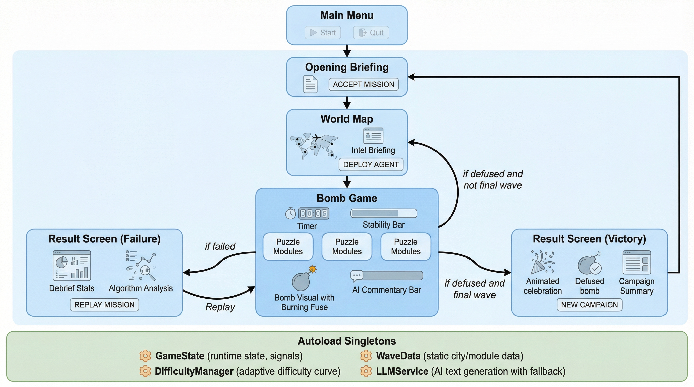
*Game flow architecture showing scene transitions, win/loss branching, and autoload singletons.*

**Game mechanics**:
- **Timer**: Starts at 150s (wave 1), decreases by 10s per wave (minimum 60s)
- **Stability**: Starts at 100, loses points per wrong action. Reaches 0 = explosion
- **Modules**: 3 per wave, drawn from a pool of 10 types. Each teaches a different algorithm
- **Win condition**: Solve all 3 modules before timer or stability hits zero
- **Campaign win**: Complete all 10 waves across all cities

---

## Architecture

### Scene Graph

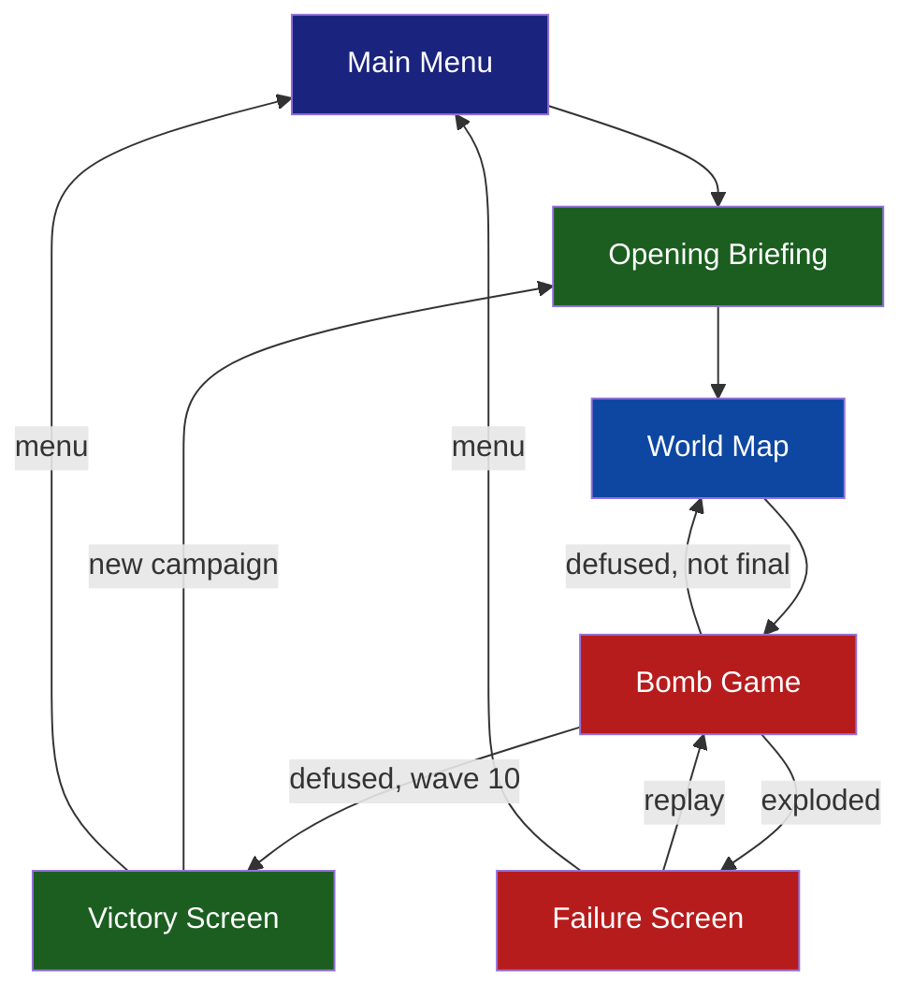

### Autoload Singletons

The game uses 4 globally accessible autoload scripts that persist across scene transitions:

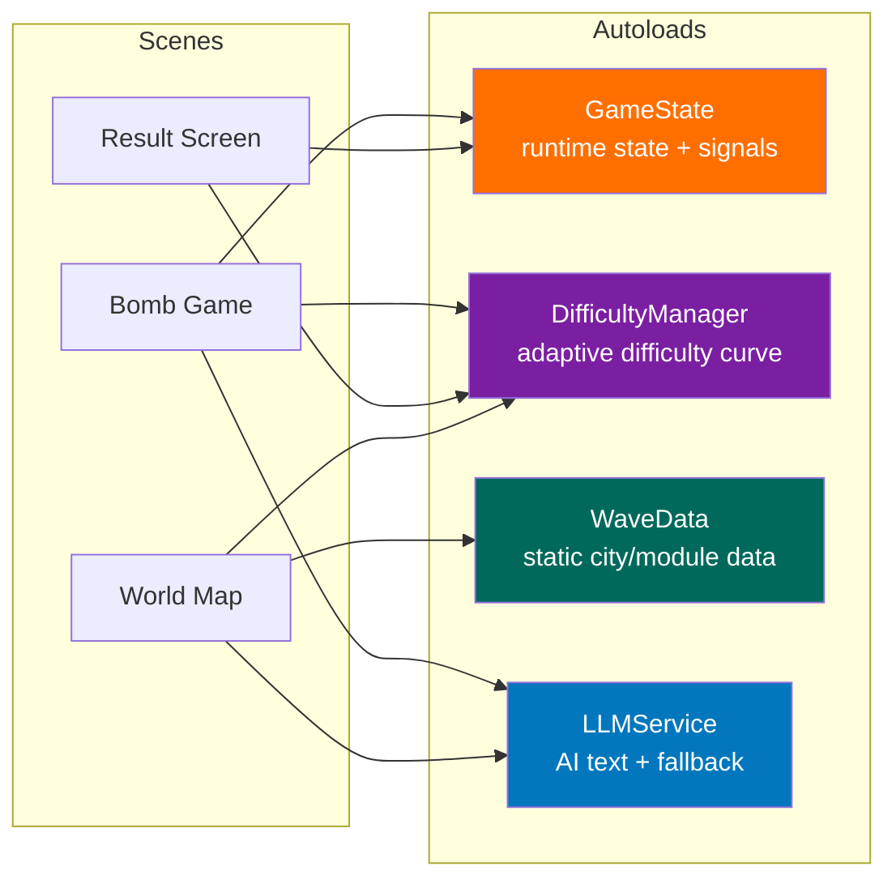

| Singleton | File | Responsibility |
|-----------|------|---------------|
| **GameState** | `autoload/game_state.gd` | Timer, stability, module tracking, signals (`stability_changed`, `timer_updated`, `game_over`), F11 fullscreen toggle |
| **DifficultyManager** | `autoload/difficulty_manager.gd` | Wave progression, performance recording, adaptive parameter calculation, mercy mode |
| **WaveData** | `autoload/wave_data.gd` | Static data: 10 city definitions (name, region, coordinates, accent color, threat level, assigned modules) |
| **LLMService** | `autoload/llm_service.gd` | Async HTTP bridge to FastAPI backend, fallback text library, signal-based UI hot-swap |

---

## Signal Flow

The game uses Godot's signal system for decoupled communication between modules and the game scene:

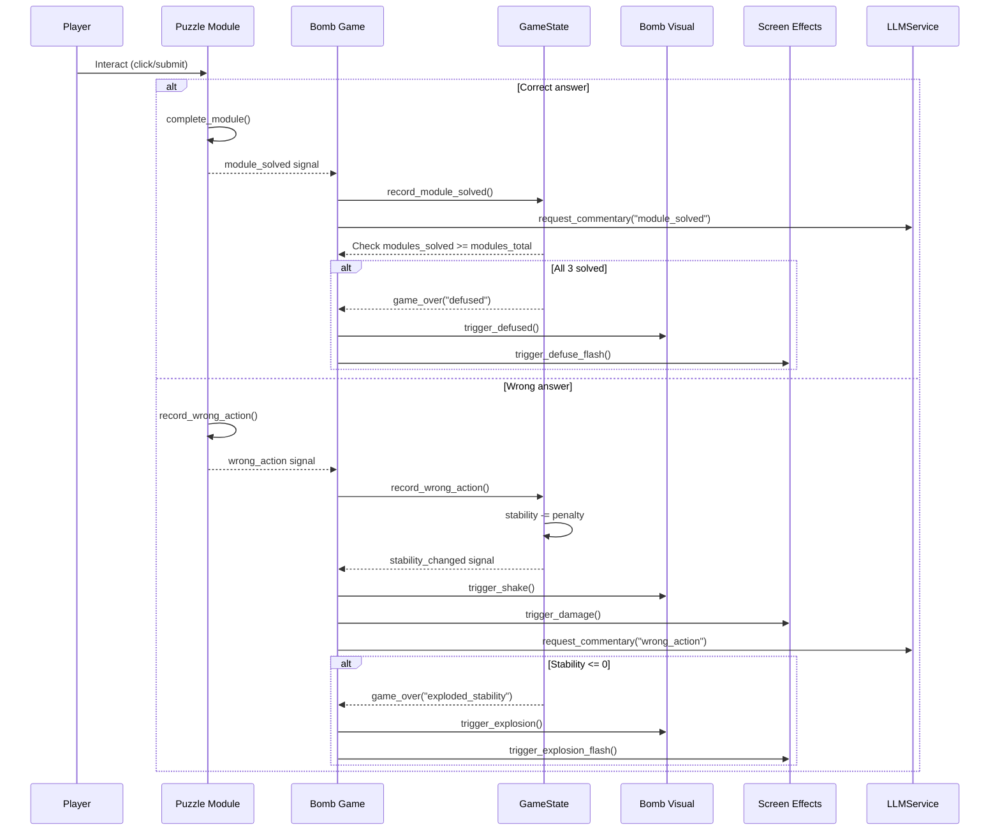

### Timer-Based Events

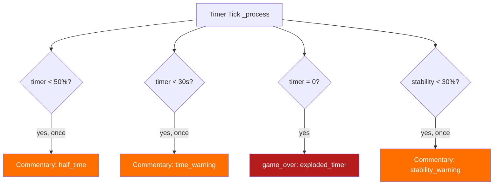

---

## Puzzle Modules

All modules extend `BaseModule` (`base_module.gd`), which provides:
- `module_solved` and `wrong_action` signals
- Shared UI elements: header label, hint label, learn label
- `complete_module()`, `record_wrong_action()`, `apply_hint()` methods
- Clip contents and minimum size (350x400)

| # | Module | Algorithm Taught | Player Task | Variant Mode |
|---|--------|-----------------|-------------|--------------|
| 1 | **Frequency Lock** | Binary Search | Guess a hidden number with high/low feedback | Hot/Cold mode (distance only) |
| 2 | **Signal Sorting** | Sorting / Inversions | Swap elements to sort; bad swaps penalized | Descending sort (30%) |
| 3 | **Wire Routing** | Shortest Path (Dijkstra) | Click nodes to build lowest-cost route | -- |
| 4 | **Pattern Sequence** | Pattern Recognition | Identify rule and fill missing number | 10 pattern types |
| 5 | **Code Breaker** | Constraint Satisfaction | Mastermind-style code cracking with Wordle colors | -- |
| 6 | **Memory Matrix** | Spatial Memory / Caching | Memorize grid pattern, then reproduce it | -- |
| 7 | **Bit Cipher** | Binary Representation | Toggle bits to match a decimal target | Decode mode (binary -> decimal) |
| 8 | **Stack Overflow** | Stack (LIFO) | Predict POP output from PUSH/POP sequence | Queue FIFO mode (40%) |
| 9 | **Priority Queue** | Priority Queue / Heap | Click tasks in priority order | Min-priority mode (35%) |
| 10 | **Logic Gates** | Boolean Logic | Set inputs to produce target circuit output | XOR/NAND gates |

### Pattern Sequence Types (10 Variants)

| Type | Example | Mathematical Rule |
|------|---------|-------------------|
| Arithmetic | 3, 7, 11, 15, 19, 23 | a + d*n (constant difference) |
| Geometric | 2, 6, 18, 54, 162, 486 | a * r^n (constant ratio) |
| Fibonacci | 2, 3, 5, 8, 13, 21 | f(n) = f(n-1) + f(n-2) |
| Squares | 4, 9, 16, 25, 36, 49 | n^2 |
| Triangular | 1, 3, 6, 10, 15, 21 | n(n+1)/2 |
| Cubes | 8, 27, 64, 125, 216, 343 | n^3 |
| Powers of 2 | 2, 4, 8, 16, 32, 64 | 2^n |
| Primes | 5, 7, 11, 13, 17, 19 | Prime number sequence |
| Alternating | 5, 13, 10, 18, 15, 23 | +d1, -d2, repeating |
| Quadratic | 6, 13, 24, 39, 58, 81 | an^2 + bn + c (constant 2nd differences) |

### Module Implementation Pattern

Every module follows the same lifecycle:

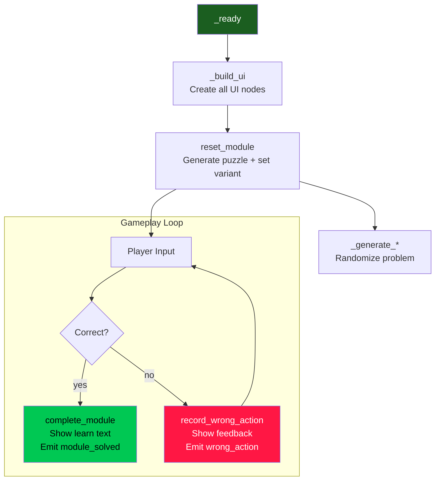

Each module's `get_module_state() -> Dictionary` reports its current state (attempts, mistakes, variant mode) to the LLM service for context-aware commentary.

---

## Campaign Structure

The game spans 10 waves across real-world cities with escalating threat levels. Cities are displayed on a Natural Earth equirectangular world map with animated flight paths between missions.

| Wave | City | Region | Threat | Modules | Accent Color |
|------|------|--------|--------|---------|-------------|
| 1 | Washington D.C. | North America | LOW | Frequency Lock, Bit Cipher, Pattern Sequence | Blue |
| 2 | London | Europe | LOW | Logic Gates, Signal Sorting, Stack Overflow | Steel |
| 3 | Paris | Europe | MODERATE | Memory Matrix, Wire Routing, Priority Queue | Gold |
| 4 | Tokyo | Asia | MODERATE | Code Breaker, Bit Cipher, Signal Sorting | Pink |
| 5 | Cairo | Africa | ELEVATED | Stack Overflow, Pattern Sequence, Wire Routing | Amber |
| 6 | Moscow | Europe | ELEVATED | Priority Queue, Logic Gates, Frequency Lock | Ice Blue |
| 7 | Mumbai | Asia | HIGH | Code Breaker, Memory Matrix, Stack Overflow | Orange |
| 8 | Sydney | Oceania | HIGH | Bit Cipher, Priority Queue, Pattern Sequence | Teal |
| 9 | Rio de Janeiro | South America | SEVERE | Wire Routing, Logic Gates, Memory Matrix | Green |
| 10 | Pyongyang | Asia | CRITICAL | Frequency Lock, Code Breaker, Signal Sorting | Red |

Every module type appears exactly **3 times** across the campaign, ensuring balanced exposure to all algorithms.

---

## Adaptive Difficulty

The difficulty engine tracks player performance and adjusts parameters wave-by-wave using a composite efficiency metric:

```
Efficiency = 0.5 * time_ratio + 0.5 * mistake_ratio
  where time_ratio   = 1 - (time_used / timer_total)     [0..1, higher = faster]
        mistake_ratio = 1 - (mistakes / max_mistakes)     [0..1, higher = fewer errors]
```

### Difficulty Scaling Parameters

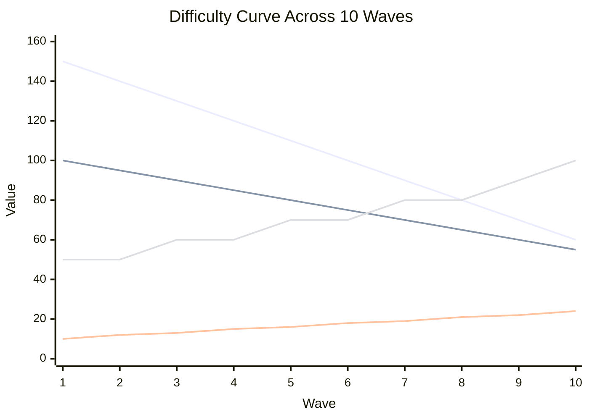

| Parameter | Wave 1 | Wave 5 | Wave 10 | Formula |
|-----------|--------|--------|---------|---------|
| Timer (s) | 150 | 110 | 60 | `max(60, 150 - (w-1)*10)` |
| Stability max | 100 | 80 | 55 | `max(50, 100 - (w-1)*5)` |
| Penalty per error | 10 | 16 | 24 | `10 + (w-1)*1.5` |
| Binary search range | 50 | 192 | 1000 | `min(1000, 50 * 1.4^(w-1))` |
| Sort elements | 5 | 7 | 10 | `min(10, 5 + (w-1)*0.5)` |
| Graph nodes | 5 | 7 | 9 | `min(9, 5 + (w-1)*0.4)` |
| Graph extra edges | 2 | 4 | 6 | `min(6, 2 + (w-1)*0.4)` |

### Adaptive Modifiers

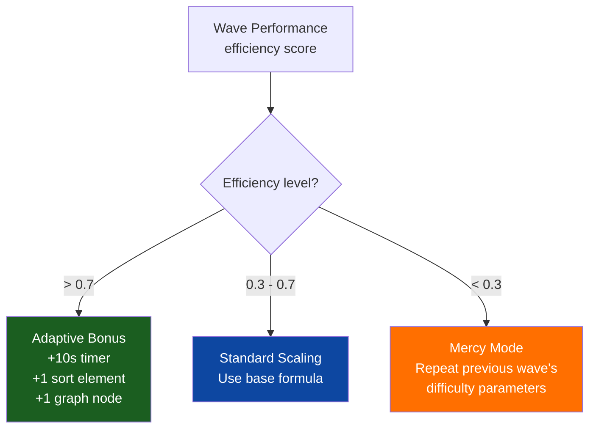

---

## Module Variants

To reduce repetitiveness across waves, modules activate alternate modes that change the core cognitive task:

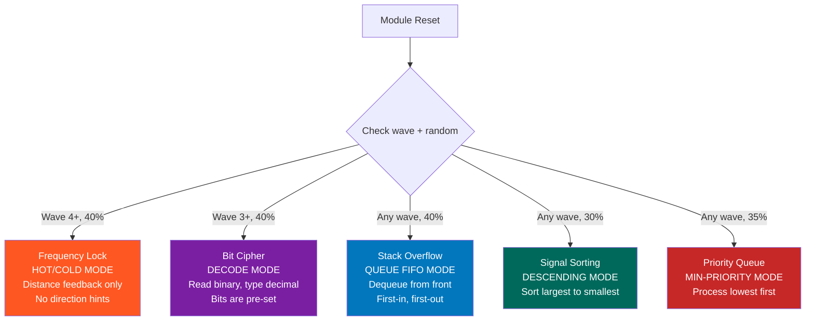

| Module | Normal Mode | Variant Mode | Activation | Cognitive Difference |
|--------|------------|--------------|------------|---------------------|
| Frequency Lock | "Too High/Low" directional feedback | "Hot/Cold" distance-only feedback | Wave 4+, 40% | Binary search vs. triangulation/gradient descent |
| Bit Cipher | Decimal -> Binary (toggle bits) | Binary -> Decimal (read & type) | Wave 3+, 40% | Encoding vs. decoding |
| Stack Overflow | Stack LIFO (pop from top) | Queue FIFO (dequeue from front) | Any wave, 40% | Last-in-first-out vs. first-in-first-out |
| Signal Sorting | Sort ascending | Sort descending | Any wave, 30% | Challenges default ascending assumption |
| Priority Queue | Max-priority (highest first) | Min-priority (lowest first) | Any wave, 35% | Max-heap vs. min-heap mental model |
| Logic Gates | AND, OR, NOT gates | AND, OR, XOR, NAND gates | Always | Expanded truth table reasoning |
| Pattern Sequence | 4 pattern types | 10 pattern types | Always | Broader mathematical pattern recognition |

---

## AI Commentary System

The game features a dual-mode text generation system that provides immediate feedback with optional LLM enhancement:

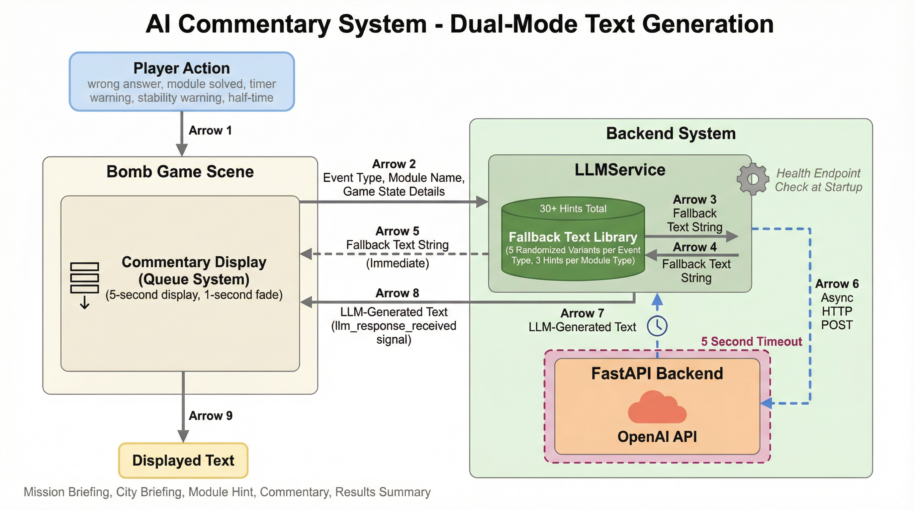
*Dual-mode architecture: synchronous fallback text + async LLM hot-swap via signal.*

### How It Works

1. **Player action occurs** (wrong answer, module solved, timer warning, etc.)
2. **LLMService** returns a fallback text string **immediately** (synchronous, never blocks gameplay)
3. If the FastAPI backend is available, an **async HTTP POST** fires in parallel
4. When the LLM response arrives, `llm_response_received` signal emits
5. The bomb game scene **hot-swaps** the displayed text with the LLM version
6. If the backend is unreachable or times out (5s), the fallback text remains

### Fallback Text Library

| Category | # of Variants | Example |
|----------|--------------|---------|
| Mission briefings | 5 | "ALERT: A rogue AI has armed an algorithmic explosive..." |
| City briefings | 3 templates | Interpolated with city name, threat level, wave number |
| Module hints | 3-6 per module (40+ total) | "Think about cutting the search space in half..." |
| Wrong action reactions | 5 | "Careful, Agent! That cost us stability." |
| Module solved reactions | 5 | "Excellent work! [Module] neutralized." |
| Timer warnings | 4 | "Clock's ticking -- move faster!" |
| Stability warnings | 4 | "Stability critical! One more mistake could be fatal." |
| Half-time alerts | 3 | "Half the time gone. Stay sharp, Agent." |
| Results summaries | 2 templates | Victory vs. failure, with interpolated stats |

### Commentary Queue System

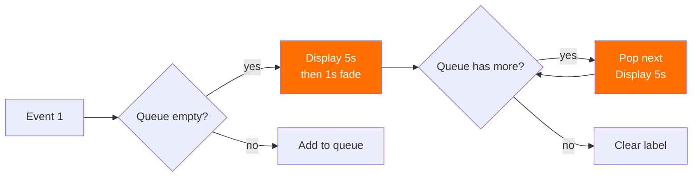

### FastAPI Backend Endpoints

| Endpoint | Method | Purpose | Request Body |
|----------|--------|---------|-------------|
| `/health` | GET | Backend availability check | -- |
| `/api/mission-briefing` | POST | Campaign/city narrative | `{city?, wave?, threat_level?}` |
| `/api/module-hint` | POST | Algorithm-specific guidance | `{module_name, current_state}` |
| `/api/commentary` | POST | Real-time event reactions | `{event, module_name, details, city, wave}` |
| `/api/results-summary` | POST | Post-game analysis | `{game_outcome, timer_remaining, total_mistakes, module_results, ...}` |

---

## Visual Systems

### Bomb Visual (`bomb_visual.gd`)

A procedurally drawn bomb with **11 rendering layers** using Godot's `_draw()` API -- no external sprites or textures:

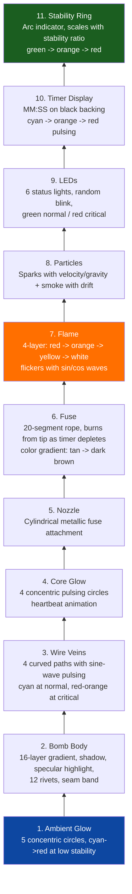

**Special states**:
- **Explosion**: 5-phase sequence over 2 seconds (flash -> fireball -> shockwave -> debris -> smoke + "BOOM!" text)
- **Defused**: Green tint, checkmark overlay, pulsing "DEFUSED" text

### Tech Background (`tech_background.gd`)

Animated sci-fi backdrop rendered every frame via `_draw()`:
- **Moving grid** with sine-wave color pulsing (shifts cyan -> red at high danger via `alert_level`)
- **40 floating particles** with sine-wave drift and alpha pulsing
- **8 Matrix-style data streams** falling top-to-bottom (binary + katakana characters)
- **HUD corner brackets** at all 4 corners
- **City watermark** (faint 60pt text, 3% opacity)
- **Scanline sweep** at 80px/sec with glow halo

### Screen Effects (`screen_effects.gd`)

Post-processing overlay via CanvasLayer (layer 10) with a fragment shader:

| Effect | Uniform | Value |
|--------|---------|-------|
| Vignette | `vignette_strength` | 0.4 |
| Scanlines | `scanline_strength` | 0.08 (animated with time) |
| Chromatic aberration | `aberration` | 0.0 - 0.008 (peaks on damage) |
| Screen flash | `flash_intensity` | 0.0 - 1.0 (red/white/green) |
| Noise grain | `noise_strength` | 0.015 |

---

## Implementation Details

### BaseModule Pattern

All 10 puzzle modules inherit from `BaseModule` (`base_module.gd`), which extends `PanelContainer`:

```gdscript
class_name BaseModule
extends PanelContainer

signal module_solved(module_name: String)
signal wrong_action(module_name: String)

@export var module_name: String = "Module"
@export var algorithm_name: String = "Algorithm"

var is_solved: bool = false
var mistakes: int = 0
var _header_label: Label = null
var _hint_label: Label = null
var _learn_label: Label = null
```

Each subclass implements:
- `_build_ui()` -- Creates all UI nodes programmatically (no .tscn scene files for module internals)
- `reset_module()` -- Generates a new puzzle, sets variant mode, resets state
- `_on_submit()` or interaction handlers -- Validates player input, gives feedback
- `get_module_state() -> Dictionary` -- Reports state for LLM context
- `get_result() -> Dictionary` -- Returns name, mistakes, algorithm for results screen

### Variant Mode Implementation

Each variant is a boolean flag set in `reset_module()` that branches generation and feedback logic:

```gdscript
# Example: Stack Overflow queue variant
func reset_module() -> void:
    super.reset_module()
    _queue_mode = randf() < 0.4    # 40% chance of FIFO mode

    if _queue_mode:
        module_name = "Data Queue"
        algorithm_name = "Queue (FIFO)"
    else:
        module_name = "Stack Overflow"
        algorithm_name = "Stack (LIFO)"
    # ... update all labels, generate operations with correct pop behavior
```

The variant flag affects: puzzle generation, operation labels, visual display, feedback text, learn text, hint text (via LLMService module name lookup), and `get_module_state()` reporting.

### Victory Detection

Victory is determined by wave advancement, not history count:

```gdscript
# bomb_game.gd -- on defuse
if DifficultyManager.current_wave >= WaveData.TOTAL_WAVES:
    DifficultyManager.advance_wave()  # current_wave becomes 11
    # -> result_screen.tscn

# result_screen.gd -- checks advancement
_is_victory = DifficultyManager.current_wave > WaveData.TOTAL_WAVES  # 11 > 10 = true
```

This avoids false positives from `wave_history.size()` which accumulates across replays.

### Adaptive Difficulty Engine

The `DifficultyManager` singleton computes wave parameters on each `GameState.reset()`:

```gdscript
func get_wave_params() -> Dictionary:
    # Check for adaptive bonuses (player doing well)
    if last_efficiency > 0.7 and w > 1:
        adaptive_timer_bonus = 10     # Extra 10 seconds
        adaptive_sort_bonus = 1       # Extra sort element
        adaptive_graph_bonus = 1      # Extra graph node

    # Check for mercy mode (player struggling)
    var mercy = last_efficiency < 0.3 and w > 1
    if mercy:
        return _calc_base_params(w - 1, 0, 0, 0)  # Repeat previous wave's difficulty

    return _calc_base_params(w, bonuses...)
```

Stats are deduplicated by wave number to handle replays correctly:

```gdscript
func get_total_stats() -> Dictionary:
    var by_wave: Dictionary = {}
    for entry in wave_history:
        by_wave[int(entry["wave"])] = entry  # Last attempt per wave wins
    # Sum from deduplicated entries
```

### Wire Routing -- Dijkstra's Algorithm

The Wire Routing module implements Dijkstra's algorithm to compute the optimal shortest path, then validates the player's path against it:

```gdscript
func _compute_shortest_path() -> void:
    var dist: Array[int] = []
    var visited: Array[bool] = []
    # Initialize distances to infinity
    for i in range(_num_nodes):
        dist.append(999999)
        visited.append(false)
    dist[_source] = 0

    for _i in range(_num_nodes):
        # Find unvisited node with smallest distance
        var u = argmin(dist, visited)
        visited[u] = true
        # Relax all neighbors
        for neighbor in _adjacency[u]:
            if dist[u] + neighbor.cost < dist[neighbor.to]:
                dist[neighbor.to] = dist[u] + neighbor.cost

    _optimal_cost = dist[_target]
```

Graph connectivity is guaranteed by a spanning path (0->1->2->...->target), with additional random edges for variety and trap routes.

### Web Export Compatibility

Several adaptations ensure the game works correctly in browsers:
- **QUIT button hidden** on web builds via `OS.has_feature("web")`
- **Unicode arrows replaced** with ASCII (`->` instead of arrows) for font compatibility
- **`gl_compatibility` renderer** for WebGL support
- **LLM backend gracefully degrades** -- fallback text is always available offline

---

## Getting Started

### Prerequisites

- **Godot 4.6+** (uses `gl_compatibility` renderer)
- **Python 3.13+** with `uv` (optional, for LLM backend)

### Run the Game

```bash
# Option 1: Godot Editor
# Open Godot -> Import -> Select game/ folder -> Press F5

# Option 2: Command line (if Godot is in PATH)
cd game
godot --path .
```

### Run the Backend (Optional)

```bash
cd backend
cp ../.env.example ../.env   # Add your OpenAI API key
uv sync
uv run python main.py        # Starts on http://127.0.0.1:8000
```

The game auto-detects the backend at startup via a health check to `http://127.0.0.1:8000/health`. If unavailable, all text uses the built-in fallback library (30+ module hints, 5+ variants per event type).

---

## Deployment

### Web (Recommended for research)

1. In Godot: **Project -> Export -> Add -> Web**
2. Export as `index.html`
3. Zip all output files together
4. Upload to [itch.io](https://itch.io):
   - Set "Kind of project" to **HTML**
   - Check **"This file will be played in the browser"**
   - Viewport: **1280 x 720**

The QUIT button auto-hides on web builds. The LLM backend uses offline fallback text in web deployments unless you deploy the FastAPI server to a public host and update `BACKEND_URL` in `llm_service.gd`.

### Desktop

Export from Godot for Windows (.exe), macOS (.dmg), or Linux (.x86_64). Distribute via GitHub Releases or direct download.

---

## Project Structure

```
Project 2/
|-- game/                          # Godot 4 project
|   |-- project.godot              # Engine config (autoloads, display, input)
|   |-- assets/
|   |   +-- world_map.png          # Natural Earth equirectangular map
|   |-- autoload/                  # Global singletons
|   |   |-- game_state.gd          # Runtime state, signals, timer, F11 toggle
|   |   |-- difficulty_manager.gd  # Adaptive difficulty, mercy mode, stats
|   |   |-- wave_data.gd           # 10 cities, module assignments, coordinates
|   |   +-- llm_service.gd         # AI text (async HTTP + 40+ fallback texts)
|   |-- modules/                   # Module scene files (.tscn)
|   |-- scenes/                    # Screen scene files (.tscn)
|   +-- scripts/                   # All GDScript source
|       |-- base_module.gd         # Abstract base for all 10 puzzle modules
|       |-- bomb_game.gd           # Main gameplay loop + commentary system
|       |-- bomb_visual.gd         # 11-layer procedural bomb rendering
|       |-- tech_background.gd     # Animated sci-fi backdrop (grid, particles, streams)
|       |-- screen_effects.gd      # Shader post-processing (vignette, aberration, flash)
|       |-- world_map.gd           # Inter-wave map with flight animations
|       |-- result_screen.gd       # Victory celebration / failure debrief
|       |-- main_menu.gd           # Title screen (QUIT hidden on web)
|       |-- opening_briefing.gd    # Campaign intro with typewriter animation
|       |-- briefing_overlay.gd    # Reusable typewriter text overlay
|       +-- [10 module scripts]    # One per puzzle type
|
|-- backend/                       # Python FastAPI server
|   |-- main.py                    # API endpoints + OpenAI integration
|   |-- pyproject.toml             # Dependencies (fastapi, openai, uvicorn)
|   +-- uv.lock                    # Locked dependency versions
|
|-- docs/
|   +-- diagrams/                  # Architecture diagrams (PNG)
|
|-- .env.example                   # Template for API keys
+-- README.md                      # This file
```

---

## Tech Stack

| Layer | Technology | Purpose |
|-------|-----------|---------|
| Game Engine | Godot 4.6 | GDScript, `gl_compatibility` renderer, HTML5 export |
| Backend | Python 3.13 + FastAPI | LLM text generation API with OpenAI |
| AI Provider | OpenAI API | Dynamic mission briefings, hints, commentary |
| Package Manager | uv (Python) | Fast dependency management |
| Deployment | itch.io (web) | Browser-based play, no install needed |
| Map Data | Natural Earth | Public domain equirectangular world map |
| Version Control | Git | Project history and collaboration |

---

## License

This project is part of academic research at the University of Ottawa. Contact the author for licensing inquiries.
